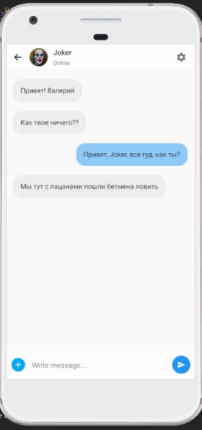
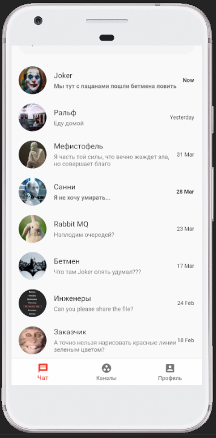

#  Урок: Структура приложения Flutter. Виджеты (Material). Stateful  и stateless виджеты. Макеты. Введение в жесты. Часть 2.

Пример макета чата приложения.

Цель урока:

1) Изучить виджеты и стилизацию.
2) Изучить работу с состояниеми: Statless и Stateful виджеты.
3) Изучить работу с Navigator.push
4) Нарисовать макет чата.

